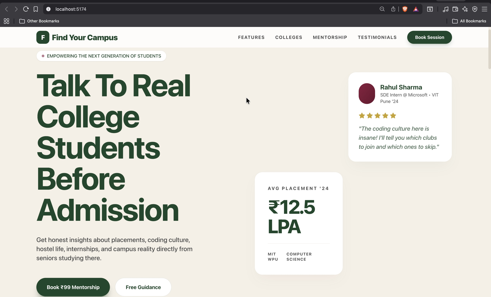
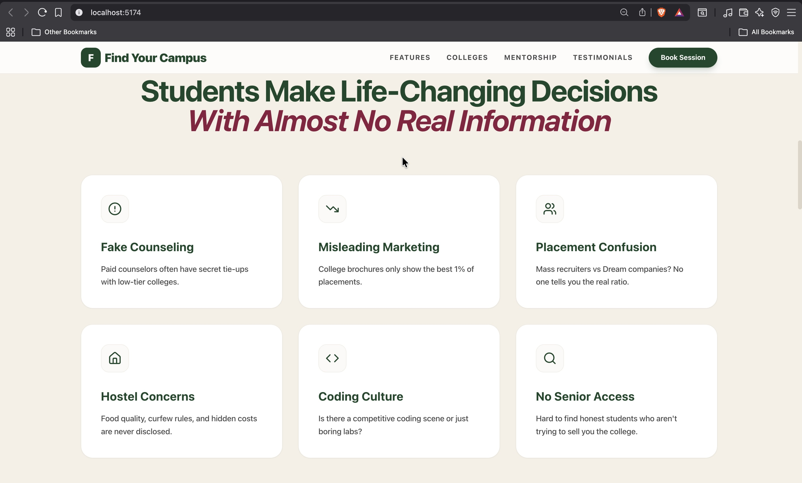
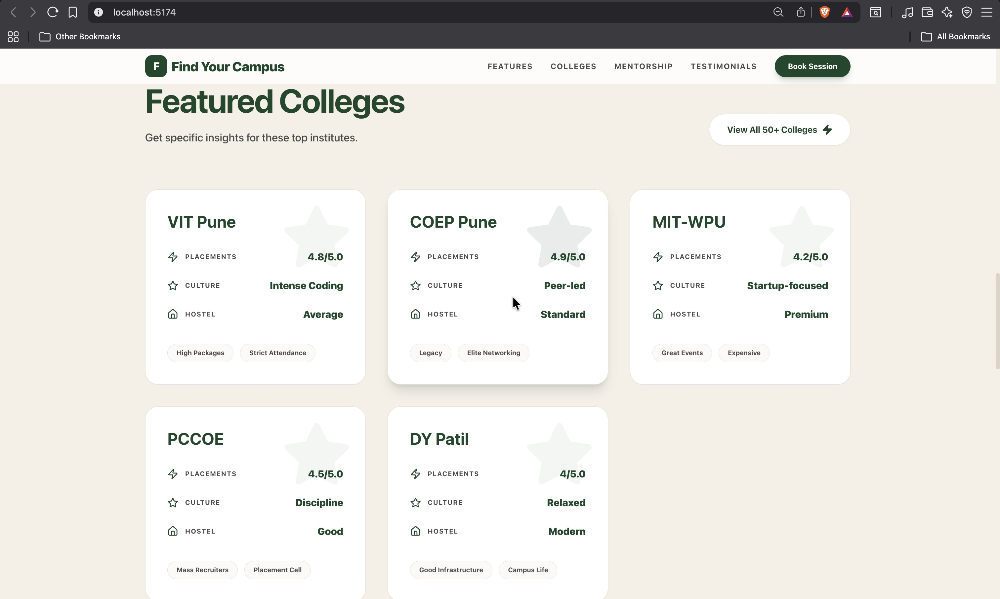
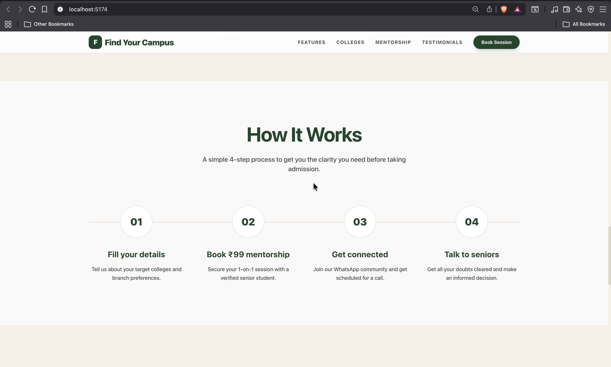
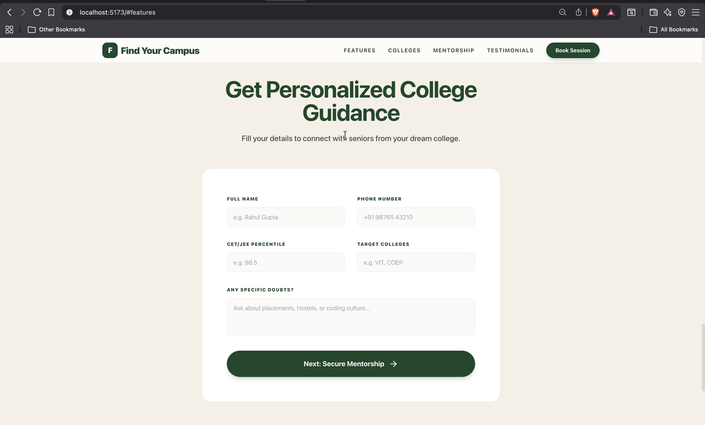

# Find Your Campus 🎓
### *Student-driven college discovery & mentorship platform.*

[](http://localhost:5174)
[](#tech-stack)

---

## 🚀 Overview
Choosing a college is one of the most expensive and life-altering decisions a student makes, yet it is often based on biased marketing and third-party rankings. **Find Your Campus** is an early-stage startup focused on bringing radical transparency to this process. We connect aspirants directly with verified college seniors for honest, ground-level insights that you simply won't find in a brochure.

---

## 📉 The Problem (Why we built this)
Current college selection is broken. Students are navigating a minefield of:
*   **Fake Counseling**: Paid agents with hidden commissions to push low-tier institutes.
*   **Marketing Noise**: Glorified brochures that hide the "dark side" of placements and campus culture.
*   **Information Gap**: No easy way to talk to a real student currently studying at the target campus.
*   **Hostel/Culture Realities**: Hidden costs, strict curfews, and toxic coding environments are only discovered *after* paying the fees.

---

## 💡 The Solution
We provide a **Peer-to-Peer Mentorship Platform**. By connecting aspirants with seniors through micro-sessions (₹99), we ensure that information flows directly from those who know best. No filters, no commissions—just the ground reality.

---

## ✨ MVP Features
*   **Mentorship Booking**: Streamlined lead collection and session scheduling.
*   **WhatsApp Onboarding**: Manual but high-touch onboarding flow for direct user feedback.
*   **Premium College Previews**: Curated cards showing placement reality and culture scores.
*   **Payment Confirmation Flow**: Simplified manual payment verification to validate willingness-to-pay.
*   **Responsive UI**: Optimized for mobile, as that's where our primary demographic (students) lives.

---

## 🧠 MVP Strategy
We are following a **"Validate First, Build Later"** approach:
*   **Fast Execution**: Built the core value proposition in days, not months.
*   **Manual Onboarding**: Intentionally using WhatsApp for scheduling to talk to our first 100 users and understand their pain points.
*   **Avoiding Overengineering**: No complex auth or heavy dashboards yet. The focus is purely on the connection between aspirant and mentor.
*   **Zero-Waste Scaling**: We only build features that our users explicitly ask for during their initial calls.

---

## 🖥️ Product Showcase
*A glimpse into the premium, student-first user experience.*

| **Aspirant Landing** | **Problem Identification** |
|:---:|:---:|
|  |  |
| *Hero & Trust Building* | *Awareness of the Pain* |

| **College Insights** | **Mentorship Booking** |
|:---:|:---:|
|  |  |
| *Direct Campus Realities* | *Frictionless Registration* |

| **Mobile Experience** |
|:---:|
|  |
| *Optimized for the Student Demographic* |

---

## 🛠️ Tech Stack

### Frontend
*   **React 19**: Component-based architecture for scalability.
*   **Vite**: For lightning-fast development and optimized builds.
*   **Tailwind CSS**: Utility-first styling for a custom, premium aesthetic.
*   **Framer Motion**: Smooth micro-animations to enhance user engagement.

### Backend & Data
*   **Node.js & Express**: Lightweight and scalable API layer.
*   **MongoDB**: Flexible document storage for leads and mentor profiles.
*   **Supabase/Google Sheets**: (Planned) For rapid data iteration in early testing.

### Deployment
*   **Vite/Vercel**: Optimized frontend hosting.
*   **Render/Railway**: Reliable backend service deployment.

---

## 📂 Project Structure
```text
├── frontend/           # Presentation layer (Vite + React)
│   ├── src/
│   │   ├── components/ # Reusable UI components
│   │   ├── pages/      # Route-level components
│   │   └── hooks/      # Custom React logic
├── backend/            # API Core (Node + Express)
│   ├── models/         # Database schemas
│   ├── controllers/    # Business logic
│   └── routes/         # API endpoints
├── screenshots/        # Product visuals for documentation
└── README.md           # The Startup Vision
```

---

## 🚦 Getting Started

### 1. Clone the repository
```bash
git clone https://github.com/CrypticAarya/career-counseling.git
cd career-counseling
```

### 2. Frontend Setup
```bash
cd frontend
npm install
npm run dev
```

### 3. Backend Setup
```bash
cd backend
npm install
# Ensure you have your MONGO_URI in a .env file
npm start
```

---

## 🎯 Current MVP Scope
The architecture is **intentionally simple**. We’ve avoided distributed systems and complex microservices to ensure we can pivot fast. The current focus is on **Lead Quality** and **Session Completion Rates**.

---

## 📈 Future Roadmap
*   **Mentor Dashboard**: Automated session management for seniors.
*   **AI Recommendation Engine**: Match students with colleges based on their CET/JEE percentiles and branch interests.
*   **Institutional Webinars**: Live campus tours and Q&A sessions.
*   **College Comparison Engine**: Side-by-side technical and cultural comparisons.
*   **Student Communities**: Campus-specific Discord/WhatsApp groups for niche interests.

---

## 📈 Growth Strategy
*   **Viral Content**: Student-led Instagram Reels showing "Expectation vs Reality" of campus life.
*   **Community Infiltration**: Active presence in JEE/CET Telegram and WhatsApp groups.
*   **Micro-Influencers**: Partnering with college students who already have a following on campus.
*   **Referral Loop**: Discounted sessions for students who bring their friends.

---

## 🔭 Vision
Our mission is to become the **Trust Layer** of higher education. We want to ensure that no student ever feels "trapped" in a college they wouldn't have chosen if they knew the truth. We are building the Yelp/Glassdoor for the Indian education system.

---

## 🤝 Contributing
We are currently in private beta. If you are a student or developer who wants to fix education, feel free to open an issue or reach out.

---

## 📧 Contact
**Founder**: [Your Name/Handle]
**Email**: campus@findyourcampus.com
**Twitter**: [@FindYourCampus]

---

## 💬 Final Note
This project started with a simple observation: students were being lied to. We are building **Find Your Campus** not just as a business, but as a solution we wish we had when we were 18. It’s about more than just colleges; it’s about making sure the next generation of engineers, doctors, and artists start their journey on the right foot.

**Let's bring the truth back to education.** 🚀
